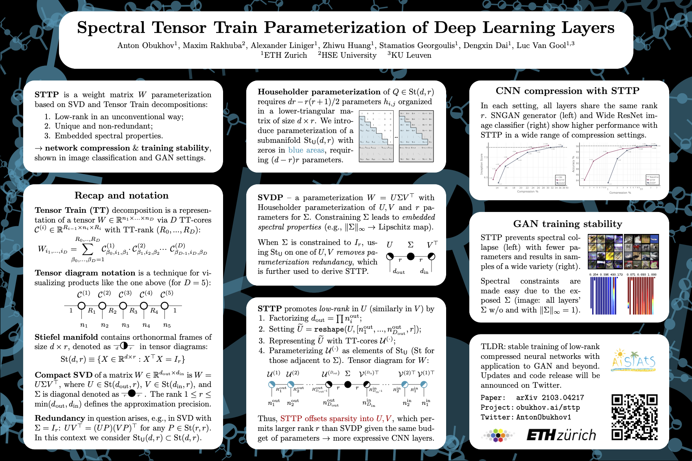

## Spectral Tensor Train Parameterization of Deep Learning Layers

This repository is the official implementation of our AISTATS 2021 paper titled "Spectral Tensor Train Parameterization 
of Deep Learning Layers" by Anton Obukhov, Maxim Rakhuba, Alexander Liniger, Zhiwu Huang, Stamatios Georgoulis, Dengxin 
Dai, and Luc Van Gool
[[arXiv]](https://arxiv.org/abs/2103.04217) 
[[PMLR]](http://proceedings.mlr.press/v130/obukhov21a.html). 

It demonstrates how to perform low-rank neural network reparameterization and its stable training in a compressed form. 
The code provides all experiments (GAN and Image Classification) from the paper (see `configs/aistats21` directory) 
with the following types of reparameterizations: SNGAN, SRGAN, SVDP, or STTP. 


## Installation

All experiments can be reproduced on a single 11Gb GPU.

Clone the repository, then create a new virtual environment, and install python dependencies into it:
```bash
python3 -m venv venv_sttp
source venv_sttp/bin/activate
pip3 install --upgrade pip
pip3 install -r requirements.txt
```

In case of problems with generic requirements, fall back to 
[requirements_reproducibility.txt](doc/requirements_reproducibility.txt).

## Logging

The code performs logging to the console, tensorboard file in the experiment log directory, and also Weights and Biases 
(wandb). Upon the first run, please enter your wandb credentials, which can be obtained by registering a free account 
with the service.

## Creating Environment Config

The training script allows specifying multiple `yml` config files, which will be concatenated during execution. 
This is done to separate experiment configs from environment configs. 
To start running experiments, create your own config file with a few environment settings, similar to 
[configs/env_lsf.yml](configs/env_lsf.yml). Generally, you only need to update paths; see other fields explained in the
[config reference](doc/config.md).

## Training

Choose a preconfigured experiment from any of the `configs/aistats21` directories, or compose your own config 
using the [config reference](doc/config.md), and run the following command:

```shell
CUDA_VISIBLE_DEVICES=0 python -m src.train --cfg configs/env_yours.yml --cfg configs/experiment.yml
```

## Poster



## Citation

Please cite our work if you found it useful:

```
@InProceedings{obukhov2021spectral,
  title={Spectral Tensor Train Parameterization of Deep Learning Layers},
  author={Obukhov, Anton and Rakhuba, Maxim and Liniger, Alexander and Huang, Zhiwu and Georgoulis, Stamatios and Dai, Dengxin and Van Gool, Luc},
  booktitle={Proceedings of The 24th International Conference on Artificial Intelligence and Statistics},
  pages={3547--3555},
  year={2021},
  editor={Banerjee, Arindam and Fukumizu, Kenji},
  volume={130},
  series={Proceedings of Machine Learning Research},
  month={13--15 Apr},
  publisher={PMLR},
  pdf={http://proceedings.mlr.press/v130/obukhov21a/obukhov21a.pdf},
  url={http://proceedings.mlr.press/v130/obukhov21a.html}
}
```

## License
This software is released under a CC-BY-NC 4.0 license, which allows personal and research use only. 
For a commercial license, please contact the authors. You can view a license summary [here](LICENSE).

Portions of source code taken from external sources are annotated with links to original files and their corresponding 
licenses.

## Acknowledgements
This work was supported by Toyota Motor Europe and was carried out at the TRACE Lab at ETH Zurich (Toyota Research on 
Automated Cars in Europe - Zurich).
